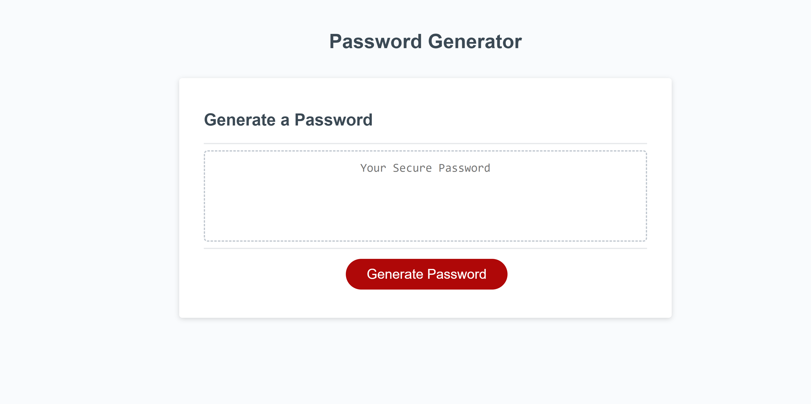
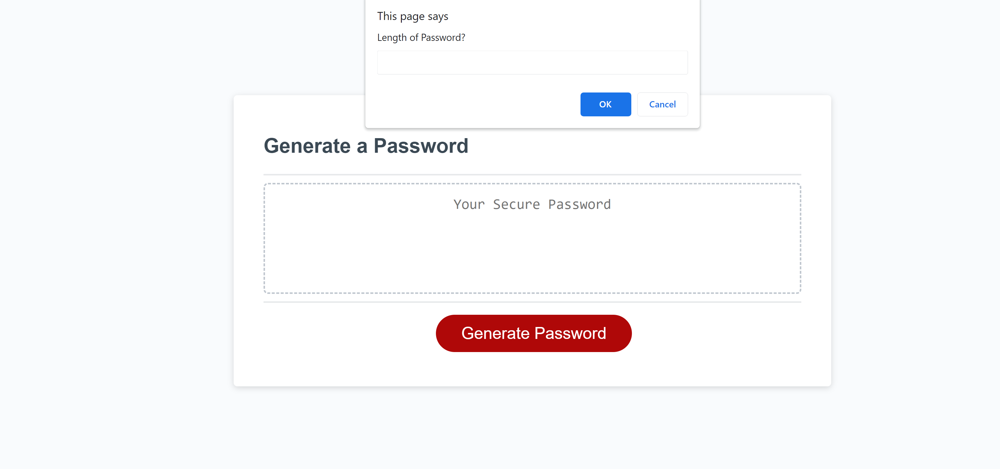
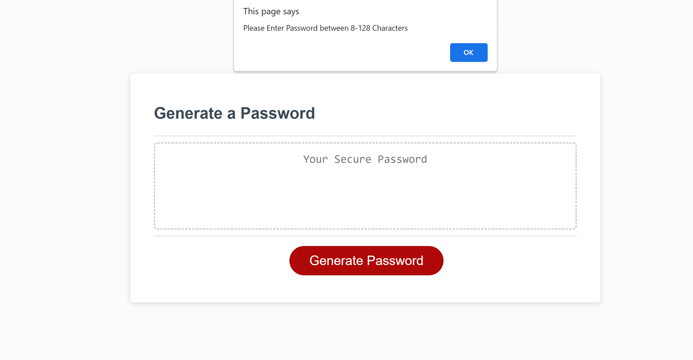
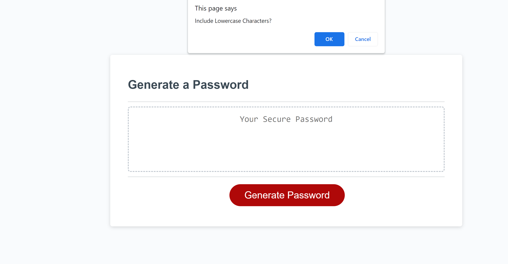
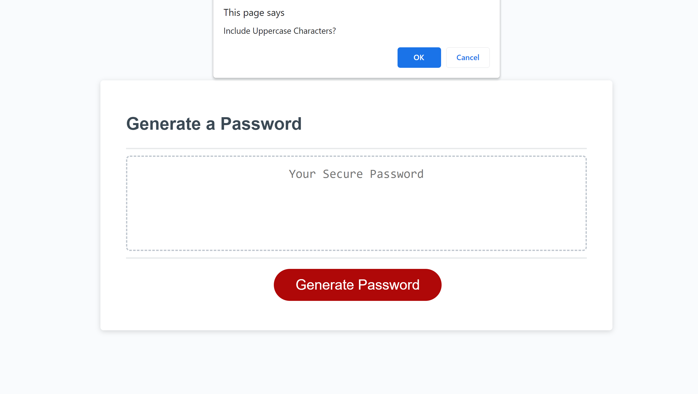
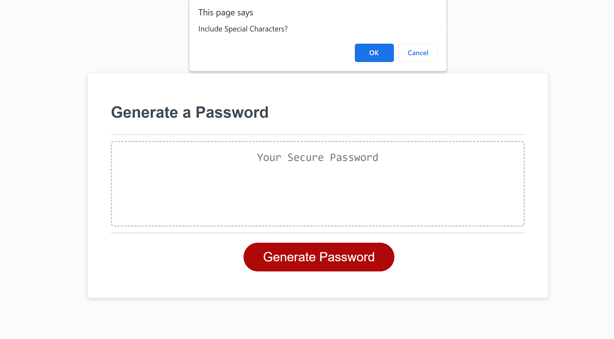
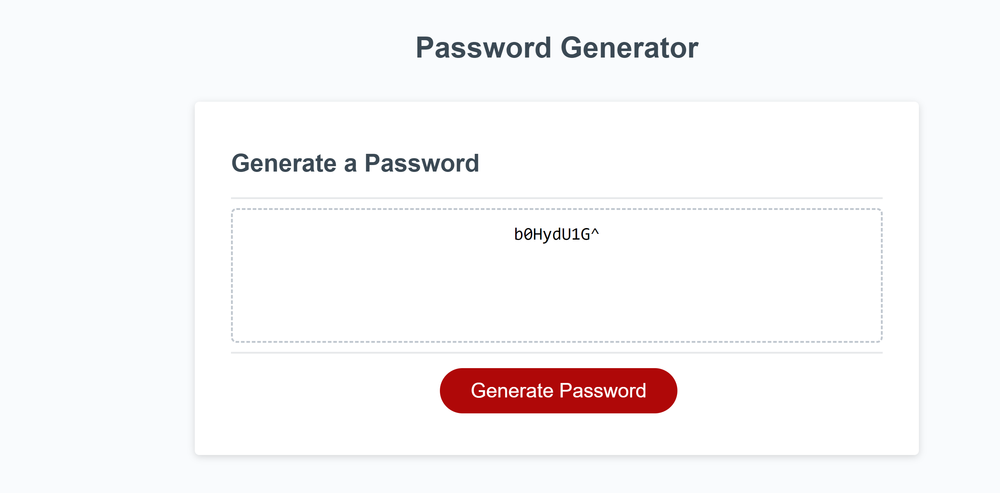

# GasiorowskiPasswordGen
The HTML, and CSS, source code for this project was given by GWU Coding Bootcamp. The Javascript was written by myself with the assitance of the tutoring program at GWU coding bootcamp
### Upon entering the site the user will see this:

### Upon clicking the "Generate Password" button the user will be prompted to input how many characters they want their password to be

### If the User selects their password to be less than 8 characters or more than 128 they will be prompted with the following message:

After accepting the prompt the user will be brought back to the initial prompt of selecting a desired character length
### After selecting the desired character length the user will be prompted with the parameters to create the passcode. They are as follows:
Whether to include lowercase characters

Whether to include uppercase characters

Whether to include numerical characters

Whether to include special characters

### After selecting their desired parameters the user will then have a password generated for them

A working link for this application is:
